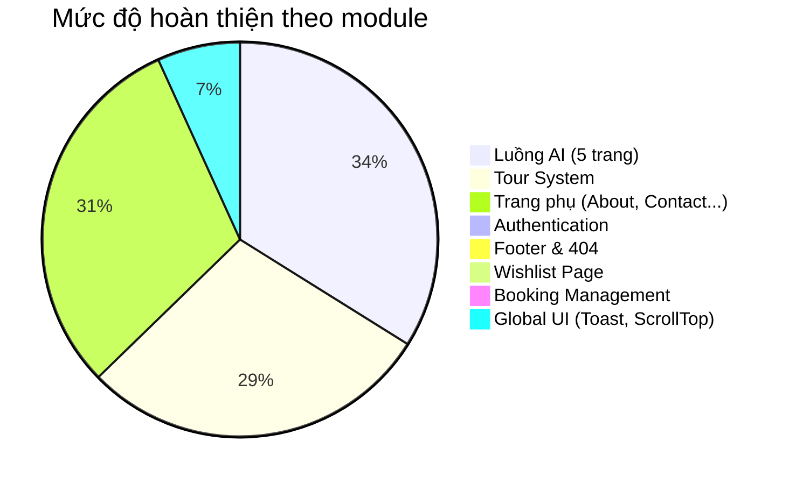

# 🔍 Phân Tích Hệ Thống Dự Án GiaLai Travel Guide

## Tổng Quan Kiến Trúc Hiện Tại

| Thành phần | Công nghệ | Ghi chú |
|---|---|---|
| Framework | React + Vite | SPA, Client-side rendering |
| Routing | React Router v6 | 13 routes, lazy-loaded |
| State Management | Zustand | 1 store duy nhất (`useTravelStore`) |
| Styling | TailwindCSS | Có design system tùy chỉnh (index.css) |
| AI Service | Gemini API | Tạo lịch trình + Chatbot |
| Map | Leaflet + OSRM | Hiển thị tuyến đường thực tế |
| Data | Static JS files | `placesData.js`, `toursData.js` |

---

## ✅ Các Chức Năng ĐÃ CÓ (12 trang)

### 1. Luồng chính: Tạo lịch trình AI

| # | Trang | File | Mô tả | Trạng thái |
|---|---|---|---|---|
| 1 | Onboarding / Landing | [OnboardingPage.jsx](file:///c:/Users/ASUS/Downloads/UXUI/src/pages/OnboardingPage.jsx) | Hero page với CTA, polaroid gallery | ✅ Hoàn chỉnh |
| 2 | Khảo sát sở thích | [SurveyPage.jsx](file:///c:/Users/ASUS/Downloads/UXUI/src/pages/SurveyPage.jsx) | Chọn 9 loại sở thích (thiên nhiên, ẩm thực, văn hóa...) | ✅ Hoàn chỉnh |
| 3 | Thông tin chuyến đi | [TripInfoPage.jsx](file:///c:/Users/ASUS/Downloads/UXUI/src/pages/TripInfoPage.jsx) | Chọn ngày, số người, ngân sách + weather insight | ✅ Hoàn chỉnh |
| 4 | Lịch trình AI | [ItineraryPage.jsx](file:///c:/Users/ASUS/Downloads/UXUI/src/pages/ItineraryPage.jsx) | Timeline + bản đồ Leaflet + routing OSRM | ✅ Hoàn chỉnh |
| 5 | Chatbot AI | [ChatbotPage.jsx](file:///c:/Users/ASUS/Downloads/UXUI/src/pages/ChatbotPage.jsx) | Chat với Gemini AI, sửa lịch trình qua hội thoại | ✅ Hoàn chỉnh |

### 2. Hệ thống Tour

| # | Trang | File | Mô tả | Trạng thái |
|---|---|---|---|---|
| 6 | Danh sách Tours | [ToursPage.jsx](file:///c:/Users/ASUS/Downloads/UXUI/src/pages/ToursPage.jsx) | Lọc theo Category, Thời gian, Giá, Sắp xếp. Wishlist | ✅ Hoàn chỉnh |
| 7 | Chi tiết Tour | [TourDetailPage.jsx](file:///c:/Users/ASUS/Downloads/UXUI/src/pages/TourDetailPage.jsx) | Lịch trình tour, booking modal, đánh giá, yêu thích | ✅ Hoàn chỉnh |

### 3. Các trang phụ

| # | Trang | File | Mô tả | Trạng thái |
|---|---|---|---|---|
| 8 | Khuyến mãi | [PromotionPage.jsx](file:///c:/Users/ASUS/Downloads/UXUI/src/pages/PromotionPage.jsx) | Flash sale, countdown timer, deal cards, newsletter | ✅ Hoàn chỉnh |
| 9 | Chi tiết địa điểm | [PlaceDetailPage.jsx](file:///c:/Users/ASUS/Downloads/UXUI/src/pages/PlaceDetailPage.jsx) | Thông tin chi tiết, gallery, đánh giá | ✅ Hoàn chỉnh |
| 10 | Tìm kiếm | [SearchPage.jsx](file:///c:/Users/ASUS/Downloads/UXUI/src/pages/SearchPage.jsx) | Tìm địa điểm theo từ khóa, empty state đẹp | ✅ Hoàn chỉnh |
| 11 | Giới thiệu | [AboutPage.jsx](file:///c:/Users/ASUS/Downloads/UXUI/src/pages/AboutPage.jsx) | Sứ mệnh, tính năng, đội ngũ, tech stack | ✅ Hoàn chỉnh |
| 12 | Liên hệ | [ContactPage.jsx](file:///c:/Users/ASUS/Downloads/UXUI/src/pages/ContactPage.jsx) | Form liên hệ, info cards, social links, map placeholder | ✅ Hoàn chỉnh |

### 4. Components & Hạ tầng

| Thành phần | File | Mô tả | Trạng thái |
|---|---|---|---|
| Navigation Bar | [NavigationBar.jsx](file:///c:/Users/ASUS/Downloads/UXUI/src/components/NavigationBar.jsx) | Responsive, search, theme toggle, mobile menu | ✅ Hoàn chỉnh |
| Global Store | [useTravelStore.js](file:///c:/Users/ASUS/Downloads/UXUI/src/store/useTravelStore.js) | Theme, wishlist, preferences, trip info, itinerary, chat | ✅ Hoàn chỉnh |
| AI Service | [aiService.js](file:///c:/Users/ASUS/Downloads/UXUI/src/services/aiService.js) | Gemini AI integration | ✅ Hoàn chỉnh |
| Data layer | [placesData.js](file:///c:/Users/ASUS/Downloads/UXUI/src/data/placesData.js), [toursData.js](file:///c:/Users/ASUS/Downloads/UXUI/src/data/toursData.js) | 15 địa điểm + 5 tour | ✅ Hoàn chỉnh |

---

## ❌ Các Chức Năng CÒN THIẾU

### 🔴 CRITICAL — Thiếu sẽ không thể gọi là "dự án hoàn chỉnh"

#### 1. Hệ thống Đăng nhập / Đăng ký (Authentication)
- **Hiện trạng:** Toàn bộ dự án hiện tại KHÔNG có khái niệm "người dùng". Wishlist lưu localStorage, booking không liên kết ai cả.
- **Cần làm:**
  - Trang Login / Register (có thể dùng Firebase Auth hoặc giả lập)
  - Quản lý trạng thái đăng nhập (store `user` trong Zustand)
  - Protected routes (ví dụ: phải đăng nhập mới được đặt tour)
  - Profile page cơ bản

#### 2. Trang 404 (Not Found)
- **Hiện trạng:** Route `*` đang redirect về `/onboarding` — người dùng không biết họ đã truy cập sai URL.
- **Cần làm:** Một trang 404 đẹp với CTA quay về trang chủ.

#### 3. Footer toàn cục
- **Hiện trạng:** Không có footer ở bất kỳ trang nào. Một website du lịch thương mại không thể thiếu footer.
- **Cần làm:** Footer chứa links, thông tin công ty, social media, bản quyền.

---

### 🟡 IMPORTANT — Thiếu sẽ khiến trải nghiệm chưa trọn vẹn

#### 4. Trang Danh Sách Yêu Thích (Wishlist Page)
- **Hiện trạng:** Có nút ❤️ Yêu thích trên Tour card, nhưng **không có trang riêng** để xem danh sách các tour đã yêu thích.
- **Cần làm:** Trang `/wishlist` hiển thị các tour đã lưu, cho phép xóa.

#### 5. Lịch sử Đặt Tour (Booking History)
- **Hiện trạng:** Modal đặt tour hiện tại chỉ hiện thông báo thành công rồi biến mất.
- **Cần làm:** Lưu trữ booking vào store, hiển thị trên trang Profile hoặc trang riêng `/my-bookings`.

#### 6. Trang Kết quả Booking (Booking Confirmation)
- **Hiện trạng:** Sau khi đặt tour, không có trang xác nhận với mã đơn hàng.
- **Cần làm:** Trang `/booking-confirmation` với thông tin booking, mã đơn, nút in / chia sẻ.

#### 7. Tìm kiếm Tours (không chỉ Places)
- **Hiện trạng:** SearchPage chỉ tìm trong `placesData`. Không tìm được tours.
- **Cần làm:** Mở rộng search để tìm cả Tours (từ `toursData`), hiển thị 2 tab kết quả.

#### 8. Scroll to Top Button
- **Hiện trạng:** Các trang dài (Tours, Promotion) không có nút cuộn lên đầu.
- **Cần làm:** Floating button góc phải dưới, hiện khi scroll quá 300px.

#### 9. Loading Skeleton toàn cục
- **Hiện trạng:** Chỉ ItineraryPage có skeleton. Các trang khác dùng PageLoader đơn giản.
- **Cần làm:** Skeleton loading cho ToursPage, SearchPage khi chuyển trang.

---

### 🟢 NICE-TO-HAVE — Làm dự án thêm chuyên nghiệp và ấn tượng

#### 10. Đa ngôn ngữ (i18n)
- **Hiện trạng:** Toàn bộ hardcode tiếng Việt.
- **Cần làm:** Nút chuyển EN/VI trên Navbar, dùng `react-i18next`.

#### 11. Chia sẻ lên Mạng Xã Hội (Social Sharing)
- **Hiện trạng:** Không có nút share cho Tour, Place, hay Itinerary.
- **Cần làm:** Nút share Facebook, Zalo, Copy link trên TourDetailPage và ItineraryPage.

#### 12. So sánh Tours
- **Hiện trạng:** Không thể so sánh 2 tour song song.
- **Cần làm:** Checkbox "So sánh" trên card → thanh floating hiện số tour đã chọn → modal so sánh bảng.

#### 13. Blog / Cẩm Nang Du Lịch
- **Hiện trạng:** Không có nội dung editorial.
- **Cần làm:** Trang `/blog` với các bài viết mẹo du lịch, trải nghiệm, hướng dẫn.

#### 14. Notifications / Toast System
- **Hiện trạng:** Chỉ ContactPage có toast thành công đơn giản.
- **Cần làm:** Hệ thống toast/notification toàn cục (thêm vào wishlist, đặt tour thành công, lỗi...).

#### 15. Breadcrumb Navigation
- **Hiện trạng:** Chỉ SearchPage có breadcrumb.
- **Cần làm:** Breadcrumb cho TourDetailPage, PlaceDetailPage, BookingPage...

#### 16. SEO & Accessibility
- **Hiện trạng:** Không có `<title>`, `<meta>` tags, `aria-labels` đầy đủ.
- **Cần làm:** React Helmet cho SEO, keyboard navigation, screen reader support.

#### 17. Print / Export Lịch Trình
- **Hiện trạng:** Không thể in hoặc xuất lịch trình.
- **Cần làm:** Nút "Xuất PDF" hoặc "In lịch trình" trên ItineraryPage.

#### 18. Responsive hoàn thiện cho Tablet
- **Hiện trạng:** Chủ yếu Mobile + Desktop. Tablet chưa được test kỹ.
- **Cần làm:** Rà soát breakpoints md (768px) cho tất cả các trang.

---

## 📊 Đánh Giá Mức Độ Hoàn Thiện

> **Tổng thể: ~60-65% hoàn chỉnh** cho một sản phẩm thương mại. Phần core (AI + Tours) rất mạnh, nhưng thiếu hẳn lớp User Management và các trang hỗ trợ quan trọng.

---

## 🗺️ Lộ Trình Đề Xuất Phát Triển

### Phase 1: Foundation — Hoàn thiện cơ sở (Ưu tiên cao nhất)
- [ ] Trang 404 Not Found
- [ ] Footer toàn cục
- [ ] Scroll to Top button
- [ ] Hệ thống Toast/Notification toàn cục

### Phase 2: User System — Hệ thống người dùng
- [ ] Trang Login / Register (Firebase Auth hoặc mock)
- [ ] User Profile Page
- [ ] Protected Routes
- [ ] Trang Wishlist riêng biệt (`/wishlist`)

### Phase 3: Booking Flow — Hoàn thiện luồng đặt tour
- [ ] Trang Booking Confirmation
- [ ] Lịch sử đặt tour (`/my-bookings`)
- [ ] Tích hợp cổng thanh toán (VNPay/MoMo placeholder)

### Phase 4: Polish — Nâng cấp trải nghiệm
- [ ] Mở rộng Search (tìm cả Tours)
- [ ] Social Sharing buttons
- [ ] Breadcrumb navigation
- [ ] SEO (React Helmet)
- [ ] Print/Export lịch trình PDF
- [ ] Đa ngôn ngữ (EN/VI)

---

## ⚠️ Các Vấn Đề Kỹ Thuật Cần Lưu Ý

| Vấn đề | Mô tả | Mức độ |
|---|---|---|
| **Dữ liệu static** | Toàn bộ data hardcode trong JS files. Chưa có backend/API | ⚠️ Chấp nhận được cho FE demo |
| **Không có Error Boundary** | Nếu 1 component crash → cả app trắng xóa | 🔴 Cần thêm |
| **Không có Analytics** | Không track hành vi người dùng | 🟡 |
| **Không có Lazy Image** | Ảnh load đồng thời, chưa intersection observer | 🟡 |
| **Console warnings** | Có thể còn React key warnings, useEffect deps | 🟢 |

---

> [!IMPORTANT]
> **Câu hỏi cho bạn:** Bạn muốn bắt đầu từ Phase nào? Tôi đề xuất bắt đầu từ **Phase 1** (Footer, 404, Toast, ScrollTop) vì đây là những thứ nhanh nhất, ít phức tạp nhất, nhưng sẽ làm dự án trông "hoàn chỉnh" ngay lập tức. Sau đó chuyển sang Phase 2 để thêm hệ thống User.
